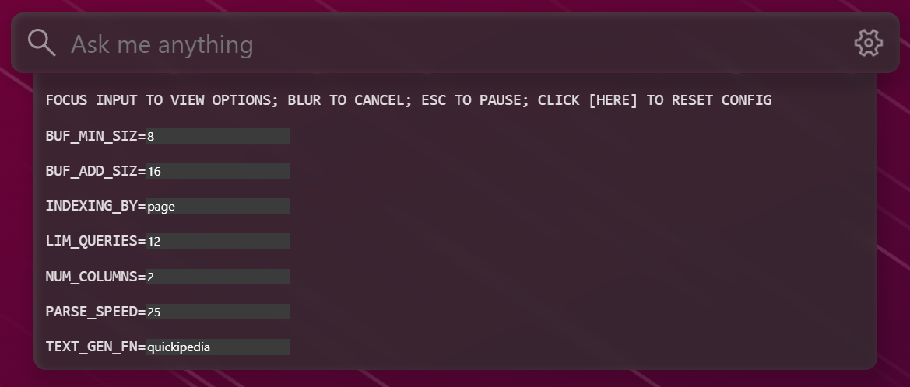

## What is this?

It's a demonstation of Astra's realtime indexing capabilities as well as a comparison of the traditional vector search model vs. the ColBERT paradigm on Astra. Text
is scraped from random wikipedia "articles" (by default), and displayed as its parsed on the right. On the left is a search bar, where you can query anything about
the parsed pages.

It's *also* an *excellent* workout for your computer :)

## Disclaimer

There may some delay between what you see being parsed due to the speed of the embedding service,
especially if you're using a lower-end computer. You can try switching out the dense model with a faster one.
 - `https://huggingface.co/intfloat/e5-small-v2` is quite good and would be simple to plug into the
   current embedding microservice. It runs ~2x faster than the default `e5-base-v2` used
 - Just be sure to update `ASTRA_DEMO_EMBEDDING_SERVICE_DIMS` if necessary

If you're using the GPU (CUDA), you may experience the first few embedding taking up to 5-6 seconds, but after that
it's much faster than the CPU equivalent. 

## The Frontend (image slightly outdated)


The frontend contains four main parts:

- The "columns" on the right, which display the texts as they're parsed and fed to the
  backend to be embedded and indexed
- The search bar, where you can query anything, and it'll return the closest matching sentences/
  extracts (depending on your settings)
- The cards, which display the resulting matches
  - You can see at a glance how similar it is by the tagged colors
    - The default model generates similarities clustered around ~.6-.8, so the color is rescaled
      to better represent the true similarity
  - Hover over any card to view its cosine similarity to the query
  - Click on any card to go to the original article to see more about the subject

## Usage

Prereqs:
- A unix system (Windows w/out WSL2 may theoreticallty work, but setting up the environment is a pain; requires cl.exe and header files and stuff on path)
- Java 21
- npm or another package manager/runner
- A newer version of Python (I used 3.11.7, I think 3.8+ works, but not sure)

From the root directory (will require a few GB or space or so for the models):
```
pip install -r embeddings/requirement.txt # (use a venv if you want)
npm install --prefix client
mkdir embeddings/checkpoints/ && curl -o colbertv2.0.tar.gz https://downloads.cs.stanford.edu/nlp/data/colbert/colbertv2/colbertv2.0.tar.gz && tar -xzf colbertv2.0.tar.gz -C embeddings/checkpoints/
```

- set the following environment variables OR set the application.yaml file in `server/src/main/resources` (env vars are a bit finnicky):
  - `export ASTRA_DEMO_DB_TOKEN=...`
  - `export ASTRA_DEMO_DB_ID=...`
  - `export ASTRA_DEMO_DB_REGION=...`
  - `export ASTRA_DEMO_DB_KEYSPACE=...`

To run everything separately, you can do (each from the root dir):
- `cd ./client; npx vite`
- `cd ./embeddings; python serve.py`
- `cd ./server; ./gradlew bootRun`

or alternatively, just run the `run.sh` file @ the root of the directory (`chmod +x run.sh` if necessary) and spam `^C` to stop it.

The default port for Vite should be `5173`, and `8082` for Spring.

## Optional environment variables:

- `export SERVER_PORT=...`
  - Sets the port for the spring backend
  - Default: `8082`
- `export ASTRA_DEMO_EMBEDDING_SERVICE_PORT=...`
  - Sets the port for the default embedding microservice
  - Default: `5000`
- `export ASTRA_DEMO_EMBEDDING_SERVICE_URL=...`
  - Sets the URL for the embedding microservice (must be updated if `port` is changed)
  - Default: `http://localhost:5000/embed`
  - Default: `base_v2`
- `export ASTRA_DEMO_EMBEDDING_SERVICE_DIMS=...`
  - Sets the dimensionality of the model
  - Default: `384`
- `export ASTRA_DEMO_EMBEDDING_SERVICE_DEVICE=...`
  - Explicitly sets the device used for embedding
  - Defaults to `"cuda" if torch.cuda.is_available() else "cpu"` if not set
- `export ASTRA_DEMO_ENTITY_TTL=...`
  - Sets the TTL for every text entity inserted into the db. Use a negative number for no TTL
  - Default: `86400 (24 hrs)`
- `export ASTRA_DEMO_SHARE_TEXTS=...`
  - Sets whether all connections should use the same shared set of texts, or if they use only what they scraped themselves
  - Default: `false`
- `export VITE_BACKEND_URL=...`
  - Sets the URL of the Spring backend
  - Default: `http://localhost:8082/`

## Client-side options



Clicking on the settings icon will get you these settings. You can click on any text box to
quickly find its valid values.

- `BUF_MIN_SIZ:` The minimum size of the text buffer before the client generates/requests more text.
- `BUF_ADD_SIZ:` How many new pieces of texts the generator provides the buffer
  - In other words, when the number of extracts left in the buffer falls under `BUF_MIN_SIZE`,
    it requests `BUF_ADD_SIZ` more extracts from the API
- `INDEXING_BY:` Determines if each page/extract is split up into sentences or fed to the database directly.
  - Using `sentence` may yield worse results, especially because sentences may be wrongly split up due to
    acronyms and such.
- `LIM_QUERIES:` The number of search results returned from the server
- `NUM_COLUMNS:` The number of columns parsing and feeding text to the server
- `PARSE_SPEED:` How fast a column burns through pieces of text (in ms per printed unit)
- `TEXT_GEN_FN:` The generation strategy for generating the text
  - `wikipedia:` Fetches extracts from wikipedia to parse, displays it word by word
  - `quickipedia:` Fetches extracts from wikipedia to parse, displays it extract by extract (much faster, less feedback)
  - `lorem:` Generates lorem-ipsum-like text

## Basic troubleshooting

Always try refreshing the page first (The site doesn't auto-reconnect to the server).

If you *consistently* run into an issue on the client-side with unexpectedly disconnecting from the server, and there's
an error in the console (in the CloseRequest) about the buffer being too large or something, do
`export VITE_CHARS_PER_CHUNK=...` with a smaller number (-500) each time until it works (it starts @ 8500)

There's also a small chance you might get rate-limited by the wikipedia API, but I highly doubt you'll run into that.

# Etc.

This hasn't been tested with multiple connections, but it should theoretically work if multiple people were to
connect to the same backend.
